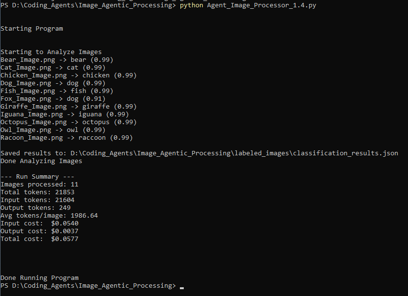
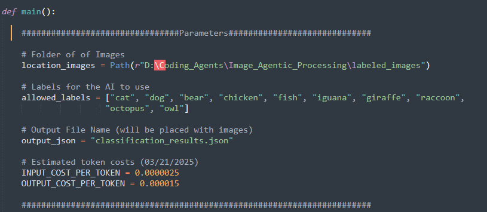

# Structured Image Classifier with OpenAI Vision

This project demonstrates how to constrain vision model outputs into a fixed label space for more predictable and reproducible behavior.

A Python pipeline for batch image classification using OpenAI vision models with:

- strict JSON-schema output  
- constrained label selection  
- batch processing over a local image folder  
- saved structured results  
- token and cost tracking  

This project shows how to move from ad hoc image prompting to a **controlled, reproducible vision pipeline**.

------------------------------------------------------------------------

## Example Run



**Note:**  
`Fox_Image.png` was intentionally introduced as a *wildcard test case* and was **not included in the allowed label set**.  
As a result, the model mapped it to the closest available class (`dog`) with a lower confidence score (0.91).

This demonstrates an important behavior of constrained classification systems:
when the correct label is unavailable, the model will still attempt to select the nearest valid option rather than abstaining.

------------------------------------------------------------------------

## What this project does

The script:

1.  Loads `.png` images from a local folder\
2.  Converts each image to a base64 data URL\
3.  Sends each image to an OpenAI vision-capable model\
4.  Forces the model to return strict JSON\
5.  Restricts predictions to an allowed label set\
6.  Saves results to a `classification_results.json` file\
7.  Tracks token usage and estimated run cost

------------------------------------------------------------------------

## Structured JSON output

The model is required to return structured JSON in a fixed format:

```json
{
  "predicted_label": "string",
  "confidence": float
}
```

------------------------------------------------------------------------

## Controlled label space (key design choice)

Instead of allowing free-form responses, the model is constrained to select from these allowed labels only.

### Why this matters

- prevents unstructured or inconsistent outputs  
- enables reliable downstream automation  
- improves reproducibility across runs  

### Tradeoff

If the correct label is not present, the model will still choose the closest available option.

This behavior is demonstrated in the `Fox_Image.png` example.



The classifier operates over a **fixed, predefined label set**:

```python
allowed_labels = ["cat", "dog", "bear", "chicken", "fish", "iguana", "giraffe", "raccoon", "octopus", "owl"]
```
------------------------------------------------------------------------

## Why this repo exists

Most image API examples stop at "send one image and print a result."

This repo shows how to build a **structured pipeline**:

-   reproducible batch processing\
-   machine-readable outputs\
-   schema enforcement\
-   cost observability

------------------------------------------------------------------------

## Project structure

```text
structured-image-classifier/
├── README.md
├── LICENSE
├── .gitignore
├── Agent_Image_Processor_1.4.py
├── assets/
│   ├── run_example.png
│   └── allowed_labels.png
└── labeled_images/
```
------------------------------------------------------------------------

## Setup

**Quick start:**  
If you already have the required Python dependencies installed (`openai`, `python-dotenv`), you can skip environment setup and run the script directly.

Otherwise, follow the full setup below.

### 1. Clone the repo

``` bash
git clone https://github.com/mjtiv/structured-image-classifier.git
cd structured-image-classifier
```

### 2. Create virtual environment

``` bash
python -m venv .venv
```

Activate:

**Windows**

``` bash
.venv\Scripts\activate
```

**Mac/Linux**

``` bash
source .venv/bin/activate
```

### 3. Install dependencies

``` bash
pip install openai python-dotenv
```

### 4. Add API key

Create `.env` file:

``` env
OPENAI_API_KEY=your_api_key_here
```

------------------------------------------------------------------------

## How to run

``` bash
python Agent_Image_Processor_1.4.py
```

------------------------------------------------------------------------

## Example output

### Typical classifications (in-scope labels)

``` text
Bear_Image.png -> bear (0.99)
Cat_Image.png -> cat (0.99)
Dog_Image.png -> dog (0.99)
Giraffe_Image.png -> giraffe (0.99)
```

### Wildcard test case (intentional misclassification)

``` text
Fox_Image.png -> dog (0.91)
```

**Note:**\
`Fox_Image.png` was intentionally introduced as a *wildcard test case*
and was **not included in the allowed label set**.

Because the classifier is constrained to a fixed set of valid labels,
the model selected the closest available category (`dog`) with a
slightly lower confidence score.

### Key behavior

This demonstrates an important property of constrained classification systems:

- the model will always return a valid label  
- even when the correct label is unavailable  
- resulting in a forced approximation rather than abstention  

------------------------------------------------------------------------

## Example JSON output

### Typical output

``` json
[
  {
    "predicted_label": "cat",
    "confidence": 0.99,
    "filename": "Cat_Image.png"
  }
]
```

### Wildcard case

``` json
[
  {
    "predicted_label": "dog",
    "confidence": 0.91,
    "filename": "Fox_Image.png"
  }
]
```
------------------------------------------------------------------------

## Failure behavior (important)

When using a constrained label set, the model will:

- always return a valid label  
- even if the correct label is unavailable  
- approximate to the closest available category  

This is a key tradeoff in controlled AI systems and should be handled in production (e.g., with an "unknown" class or confidence thresholds).

------------------------------------------------------------------------

## Key design choices

### Strict JSON schema

Ensures reliable parsing and downstream automation.

### Closed label set

Forces classification into a controlled set, exposing edge cases.

### Cost tracking

Tracks token usage to estimate run cost.

------------------------------------------------------------------------

## Limitations

-   PNG-only input\
-   Hardcoded label list\
-   No retry logic\
-   No evaluation metrics

------------------------------------------------------------------------

## Potential Future improvements

-   CLI arguments for paths and labels\
-   Support JPG / WEBP\
-   CSV export\
-   Retry + logging\
-   Confusion matrix / evaluation

------------------------------------------------------------------------

## License

MIT

